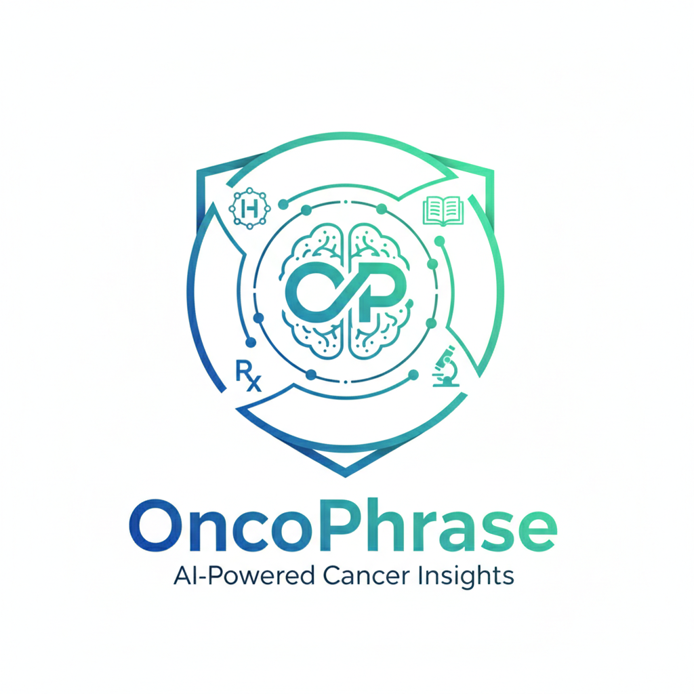
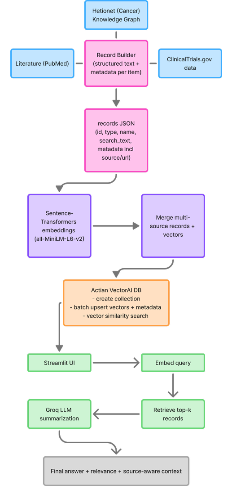

<p align="center">
  
</p>

<h1 align="center">OncoPhrase</h1>
<p align="center"><em>Domain-grounded semantic discovery engine for oncology</em></p>

**OncoPhrase** is a domain-grounded semantic discovery engine for oncology that uses a retrieval-augmented generation (RAG) pipeline. It combines **Hetionet knowledge graph data**, **PubMed literature**, and **ClinicalTrials.gov records** into a unified vector search layer, then uses an LLM to generate summaries **grounded in retrieved evidence**.

Instead of relying on exact keyword search, OncoPhrase supports **natural-language biomedical queries** and retrieves relevant genes, diseases, drugs, and trials based on **semantic meaning**.

---

## Why we built this

Information about cancer and related diseases is scattered across many different places. Some of it lives in structured knowledge graphs like Hetionet, which aren’t easily accessible to most people. Some of it is buried inside research papers and clinical trials that are difficult and time-consuming to navigate. While frontier AI tools can summarize information quickly, they are known to hallucinate or provide answers without clearly showing where the information comes from.

We felt there was a gap between powerful biomedical data sources and accessible, trustworthy question-answer systems.

We wanted to build something that acts as a one-stop, question-driven resource for cancer knowledge — a system that understands meaning rather than just keywords, retrieves information from curated biomedical sources, and clearly points users back to where that information came from.

We built OncoPhrase with that goal in mind. It combines structured graph data, research literature, and clinical trial information into a single semantic search layer, and then uses an LLM only to summarize retrieved evidence. The result is a tool that can serve a wide range of users — from individuals curious about cancer biology, to patients and families trying to educate themselves, to researchers looking to quickly explore associations between genes, diseases, and treatments.

---

## Requirements

- Python 3.10+ (recommended)
- Conda (recommended for environment setup)
- Actian VectorAI DB (running locally or accessible remotely)
- Groq API key (for LLM summarization)
- Hugging Face access (optional; model downloads may work without a token but can be rate-limited)

---

## Usage

### 1) Start Actian VectorAI DB
Make sure your Actian VectorAI DB instance is running locally (or update the host in the notebook/app config).

### 2) Load vectors and metadata into Actian
Run the ingestion notebook:

- `notebooks/06_load_to_actian.ipynb`

This creates the collection and batch-upserts:
- merged embeddings
- merged records (metadata payloads)

### 3) Launch the Streamlit app
```bash
streamlit run app/app.py
```


## How we built it

We built OncoPhrase as a **multi-source biomedical RAG pipeline**.



### 1) Data ingestion and record building

We curated three oncology-focused data modalities:

- **Hetionet** (knowledge graph entities and relationships)
- **PubMed** (oncology abstracts)
- **ClinicalTrials.gov** (cancer-related trial records)

For each source, we converted raw data into a unified record schema:

- `id`
- `entity_type`
- `identifier`
- `name`
- `search_text`
- `metadata` (including `source`, URLs, and source-specific fields)

The `search_text` field is the key semantic representation used for embedding and retrieval.

### 2) Embeddings

We generated vector embeddings using:

- **Sentence Transformers**
- model: `sentence-transformers/all-MiniLM-L6-v2`

Each modality was embedded separately, then merged into one shared vector space (same embedding dimension).

### 3) Merging multi-source corpora

We merged:

- Hetionet records + embeddings
- PubMed records + embeddings
- ClinicalTrials records + embeddings

into a **single unified corpus** for semantic search.

### 4) Actian VectorAI DB integration

We used **Actian VectorAI DB** to:

- create a vector collection
- batch upsert embeddings + metadata
- run vector similarity search over the merged corpus

This became the retrieval backend of the app.

### 5) UI + LLM summarization

We built a **Streamlit** interface for user queries. The app:

1. embeds the user query
2. retrieves top-k semantically similar records from Actian
3. passes retrieved evidence to a **Groq-hosted LLM**
4. generates a grounded summary (no unsupported claims)

---

## Contributions

| Team Member | Contribution |
|---|---|
| **Shaunak Raole** | Built the data pipeline for OncoPhrase, including curating cancer-focused records from Hetionet, PubMed, and ClinicalTrials.gov; generating embeddings; designing the multi-source record schema; merging cross-source records/embeddings; and shaping retrieval logic and project write-up. |
| **Sanjana Suresh** | Integrated the embedding pipeline with **Actian VectorAI DB**, implemented vector collection creation and batch upserts, and built the **Streamlit frontend** for interactive semantic search, result inspection, and source-aware user experience. |